# مخطط قاعدة البيانات وشرح الجداول

## نظرة عامة

قاعدة البيانات مصممة حول فكرة أن لوحة الإدارة هي مركز القرار، والوكيل يسجل مراقبة وتحليلا وطلبات تنفيذ مقيدة. التعريفات التي تتغير مع الوقت مثل ملفات المراقبة، الوكلاء المتخصصين، الأدوات، والحلول لها جداول versions حتى نستطيع معرفة أي نسخة استُخدمت في كل تقرير أو تنفيذ.

## المخطط العام

```mermaid
erDiagram
    users ||--o{ user_roles : has
    roles ||--o{ user_roles : assigned
    roles ||--o{ role_permissions : grants
    permissions ||--o{ role_permissions : included

    server_groups ||--o{ server_group_members : contains
    servers ||--o{ server_group_members : member
    servers ||--o{ server_credentials : has

    monitoring_profiles ||--o{ monitoring_profile_versions : versioned_by
    monitoring_profiles ||--o{ monitoring_profile_assignments : assigned
    servers ||--o{ monitoring_profile_assignments : direct_target
    server_groups ||--o{ monitoring_profile_assignments : group_target

    specialist_agents ||--o{ specialist_agent_versions : versioned_by

    monitoring_cycles ||--o{ periodic_monitoring_reports : includes
    servers ||--o{ periodic_monitoring_reports : checked_by
    periodic_monitoring_reports ||--o{ monitoring_metrics : records
    periodic_monitoring_reports ||--o{ specialist_agent_runs : triggers
    monitoring_profiles ||--o{ monitoring_metrics : source_profile
    specialist_agents ||--o{ specialist_agent_runs : runs

    periodic_monitoring_reports ||--o{ issues : may_create
    servers ||--o{ issues : has
    issues ||--o{ issue_events : tracks
    issues ||--o{ issue_comments : discusses

    reports ||--o{ report_items : contains

    allowed_tools ||--o{ allowed_tool_versions : versioned_by
    allowed_solutions ||--o{ solution_versions : versioned_by
    issues ||--o{ execution_requests : requests
    servers ||--o{ execution_requests : target
    allowed_solutions ||--o{ execution_requests : proposes
    execution_requests ||--o{ execution_results : produces

    documents ||--o{ document_chunks : chunks
    documents ||--o{ links : may_index

    users ||--o{ chat_sessions : starts
    chat_sessions ||--o{ chat_messages : contains
    users ||--o{ telegram_chats : linked
    telegram_chats ||--o{ telegram_events : receives

    users ||--o{ audit_logs : actor
```



## مجموعة الهوية والصلاحيات

### `users`

يحفظ مستخدمي لوحة الإدارة. يحتوي البريد، الاسم، حالة الحساب، ووقت آخر دخول. كلمة المرور تحفظ كـ `password_hash` وليس كنص واضح.

الاستخدام الأساسي:

- تسجيل الدخول.
- ربط العمليات بالمستخدم.
- معرفة من أنشأ أو وافق أو عدل.

### `roles`

يحفظ الأدوار مثل `owner`, `admin`, `operator`, `viewer`, `auditor`.

الاستخدام الأساسي:

- تجميع الصلاحيات.
- تسهيل إدارة المستخدمين.

### `permissions`

يحفظ الصلاحيات الدقيقة، مثل:

```text
servers.read
servers.write
issues.manage
solutions.approve
```

الاستخدام الأساسي:

- تطبيق RBAC داخل API.
- فصل الدور عن الصلاحيات الفعلية.

### `role_permissions`

جدول ربط بين الأدوار والصلاحيات.

الاستخدام الأساسي:

- تحديد الصلاحيات التي يملكها كل دور.

### `user_roles`

جدول ربط بين المستخدمين والأدوار.

الاستخدام الأساسي:

- منح مستخدم واحد أكثر من دور.

## مجموعة السيرفرات

### `servers`

يحفظ بيانات السيرفرات التي يديرها النظام:

- الاسم.
- hostname.
- IP.
- نوع النظام.
- البيئة: development / staging / production.
- الحالة: active / disabled / maintenance.
- metadata مرنة.

الاستخدام الأساسي:

- تعريف السيرفرات.
- ربط المراقبة والتقارير والمشكلات بسيرفر محدد.

### `server_groups`

يحفظ مجموعات السيرفرات، مثل:

```text
production-web
staging-database
customer-a
```

الاستخدام الأساسي:

- تطبيق ملفات مراقبة أو صلاحيات على مجموعة كاملة.

### `server_group_members`

جدول ربط بين السيرفرات والمجموعات.

الاستخدام الأساسي:

- السماح للسيرفر أن يكون ضمن أكثر من مجموعة.

### `server_credentials`

يحفظ مرجعا إلى اعتماد الاتصال بالسيرفر، وليس السر نفسه.

الحقل المهم:

```text
secret_ref
```

الاستخدام الأساسي:

- ربط السيرفر بمفتاح SSH أو token محفوظ في Secrets Manager لاحقا.
- تجنب تخزين الأسرار كنص واضح.

## مجموعة ملفات المراقبة

### `monitoring_profiles`

يمثل ملف المراقبة ككيان عام، مثل:

```text
linux-baseline
service-health-baseline
nginx-health
```

الاستخدام الأساسي:

- إدارة ملف المراقبة من لوحة الإدارة.
- معرفة النسخة الحالية.
- تفعيل أو تعطيل الملف.

### `monitoring_profile_versions`

يحفظ كل نسخة فعلية من ملف المراقبة كـ JSONB.

الاستخدام الأساسي:

- حفظ قواعد التحليل.
- حفظ metrics المطلوبة.
- حفظ triggers للوكلاء المتخصصين.
- تتبع أي تعديل عبر version.

### `monitoring_profile_assignments`

يربط ملف المراقبة بسيرفر واحد أو مجموعة سيرفرات.

الاستخدام الأساسي:

- تحديد أي ملفات مراقبة تعمل على أي سيرفر.
- دعم schedule خاص لكل assignment لاحقا.

## مجموعة الوكلاء المتخصصين

### `specialist_agents`

يمثل وكيلا متخصصا قابلا للإدارة من لوحة الإدارة، مثل:

```text
nginx-health-specialist
disk-health-specialist
postgres-health-specialist
```

الاستخدام الأساسي:

- تعريف الوكلاء المتخصصين.
- تفعيل أو تعطيل وكيل.
- معرفة النسخة الحالية.

### `specialist_agent_versions`

يحفظ تعريف نسخة الوكيل المتخصص:

- المجال.
- الأدوات المسموحة.
- triggers.
- input metrics.
- output schema.
- سياسة sandbox.

الاستخدام الأساسي:

- تشغيل وكيل متخصص بإصدار محدد.
- منع تغييرات التعريف من التأثير على تقارير قديمة.

### `specialist_agent_runs`

يسجل كل تشغيل فعلي لوكيل متخصص ضمن تقرير مراقبة سيرفر.

الاستخدام الأساسي:

- معرفة لماذا تم تشغيل الوكيل.
- حفظ نتيجة التحليل المتخصص.
- ربط التشغيل بدورة مراقبة وتقرير سيرفر.

## مجموعة المراقبة الدورية

### `monitoring_cycles`

يمثل دورة مراقبة دورية كاملة.

مثال:

```text
cycle_2026_08_04_001
```

الاستخدام الأساسي:

- معرفة متى بدأت الدورة ومتى انتهت.
- تتبع حالة الدورة: queued / running / completed / failed.
- حفظ ملخص عام للدورة.

### `periodic_monitoring_reports`

يمثل تقرير مراقبة لسيرفر واحد داخل دورة مراقبة.

الاستخدام الأساسي:

- تسجيل نتيجة المراقبة الشاملة لكل سيرفر.
- حفظ التحليل الأولي والنهائي.
- تحديد حالة السيرفر في تلك الدورة.

### `monitoring_metrics`

يحفظ القيم التي جمعتها أدوات المراقبة.

الاستخدام الأساسي:

- تخزين القيم المنظمة.
- ربط القيمة بملف مراقبة إن وجد.
- حفظ مرجع للـ raw output عند الحاجة.

## مجموعة المشكلات

### `issues`

يحفظ المشكلة التي اكتشفها النظام أو المستخدم.

الاستخدام الأساسي:

- تسجيل المشكلة المؤكدة أو التحذير.
- ربط المشكلة بالسيرفر والتقرير.
- حفظ الشدة والدليل.

### `issue_events`

يحفظ تاريخ أحداث المشكلة.

أمثلة:

```text
created
acknowledged
severity_changed
resolved
solution_suggested
```

الاستخدام الأساسي:

- تتبع دورة حياة المشكلة.

### `issue_comments`

يحفظ تعليقات المستخدمين أو المشغلين على المشكلة.

الاستخدام الأساسي:

- توثيق النقاش البشري.
- إضافة ملاحظات تشغيلية.

## مجموعة التقارير

### `reports`

يحفظ التقارير المولدة، مثل:

```text
daily_monitoring
weekly_summary
critical_issues
execution_report
```

الاستخدام الأساسي:

- إدارة التقارير العامة خارج تقرير مراقبة السيرفر الواحد.
- حفظ مرجع ملف PDF أو HTML لاحقا.

### `report_items`

يحفظ عناصر التقرير.

الاستخدام الأساسي:

- تقسيم التقرير إلى بنود قابلة للعرض.
- تخزين الرسوم أو الجداول أو الملخصات كـ JSONB.

## مجموعة الأدوات والحلول

### `allowed_tools`

يمثل أداة مسموحة أو قابلة للمراجعة.

أنواع الأدوات:

```text
readonly
sandbox
execution
notification
```

الاستخدام الأساسي:

- منع الوكيل من استخدام أدوات غير معرفة.
- فصل القراءة عن التنفيذ.

### `allowed_tool_versions`

يحفظ تعريف كل نسخة من الأداة.

الاستخدام الأساسي:

- تحديد command template.
- تحديد flags المسموحة.
- تحديد هل تحتاج موافقة.

### `allowed_solutions`

يمثل حلا مسموحا أو مرشحا للسماح.

الاستخدام الأساسي:

- إدارة الحلول من لوحة الإدارة.
- جعل كل الحلول غير مفعلة افتراضيا حتى يراجعها المطور.

### `solution_versions`

يحفظ نسخة الحل الفعلية.

الاستخدام الأساسي:

- حفظ pre-checks.
- حفظ خطوات التنفيذ.
- حفظ post-checks.
- حفظ rollback.
- تحديد مستوى الخطر ومتطلبات الموافقة وsandbox.

## مجموعة التنفيذ

### `execution_requests`

يمثل طلب تنفيذ أو اختبار حل.

مهم: وجود السجل لا يعني أن التنفيذ حدث.

الأوضاع:

```text
dry_run
sandbox
production_execution
```

الاستخدام الأساسي:

- تسجيل طلب تجربة أو تنفيذ.
- حفظ قرار Policy Engine.
- حفظ حالة الموافقة البشرية.

### `execution_results`

يحفظ نتيجة طلب التنفيذ أو الاختبار.

الاستخدام الأساسي:

- حفظ نتيجة sandbox.
- حفظ logs reference.
- معرفة هل نجح الاختبار أو فشل.

## مجموعة RAG والوثائق

### `documents`

يحفظ الوثائق التي يعتمد عليها الوكيل.

المصادر:

```text
upload
link
manual
```

الاستخدام الأساسي:

- إدارة الوثائق من لوحة الإدارة.
- ربط الوثائق بالفهرسة.

### `document_chunks`

يحفظ مقاطع الوثائق بعد تقسيمها.

الحقل المهم:

```text
embedding vector(1536)
```

الاستخدام الأساسي:

- البحث الدلالي عبر pgvector.
- إرجاع مصادر للوكيل عند التحليل.

### `links`

يحفظ الروابط التي يضيفها المستخدم.

الاستخدام الأساسي:

- ربط URL بوثيقة مفهرسة.
- إدارة مصادر خارجية.

## مجموعة المحادثة وتيليغرام

### `chat_sessions`

يحفظ جلسات المحادثة داخل لوحة الإدارة.

الاستخدام الأساسي:

- ربط المحادثة بالمستخدم.
- حفظ سياق المحادثة.

### `chat_messages`

يحفظ رسائل المحادثة.

الأدوار:

```text
user
assistant
system
tool
```

الاستخدام الأساسي:

- حفظ سجل الحوار.
- تدقيق قرارات الوكيل لاحقا.

### `telegram_chats`

يحفظ محادثات تيليغرام المربوطة بالنظام.

الاستخدام الأساسي:

- إرسال التنبيهات.
- ربط chat بمستخدم عند الحاجة.
- تعطيل محادثة عند الحاجة.

### `telegram_events`

يحفظ أحداث تيليغرام الواردة أو المرسلة.

الاستخدام الأساسي:

- تدقيق التنبيهات.
- تتبع الأوامر المحدودة.

## مجموعة الوكيل والتدقيق

### `agent_permissions`

يحفظ صلاحيات الوكيل كتعريفات مستقلة.

أمثلة:

```text
agent.read_metrics
agent.read_logs
agent.create_issue
agent.suggest_solution
agent.run_sandbox
```

الاستخدام الأساسي:

- فصل صلاحيات الوكيل عن صلاحيات المستخدمين.
- التحكم بما يسمح للوكيل فعله.

### `audit_logs`

يحفظ كل عملية حساسة.

الاستخدام الأساسي:

- معرفة من فعل ماذا ومتى.
- حفظ قرار Policy Engine.
- حفظ الحالة قبل وبعد.
- تدقيق أي محاولة تنفيذ أو تغيير صلاحيات.

## ملاحظات مهمة

- أغلب التعريفات التشغيلية تستخدم `JSONB` لتوفير مرونة في البداية.
- جداول versions أساسية حتى لا نفقد تاريخ التعريفات.
- `secret_ref` فقط يحفظ في قاعدة البيانات، وليس الأسرار نفسها.
- `execution_requests.policy_decision` هو نقطة ربط مهمة مع Policy Engine لاحقا.
- `audit_logs` يجب أن يستخدم في كل عملية حساسة من أول نسخة API.
